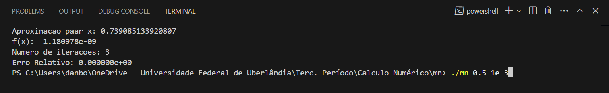

# Método da Bissecção 

O método de Newton é usado para encontrar raízes de funções. Dado um ponto inicial próximo da raiz, ele calcula sucessivas aproximações
Cada iteração ajusta o valor com base na função e sua derivada, refinando o valor até atingir a precisão desejada. O método é rápido, mas requer uma boa aproximação inicial e que a derivada não seja nula.
# Como rodar

Para compilar use: `gcc -o mn main.c -lm `
  - -lm pois estamos usando biblioteca matematica

  Já para roda use `./mn 0.5 1e-12` 
  - Primeiro primeiro parametro é o executável
  - O segundo é a aproximação inicial
  - O ultimo é o erro permitido

  # A função
  A função usada no código é x - cos(x), sua derivada, já implementada é 1.0 + sin(x)
